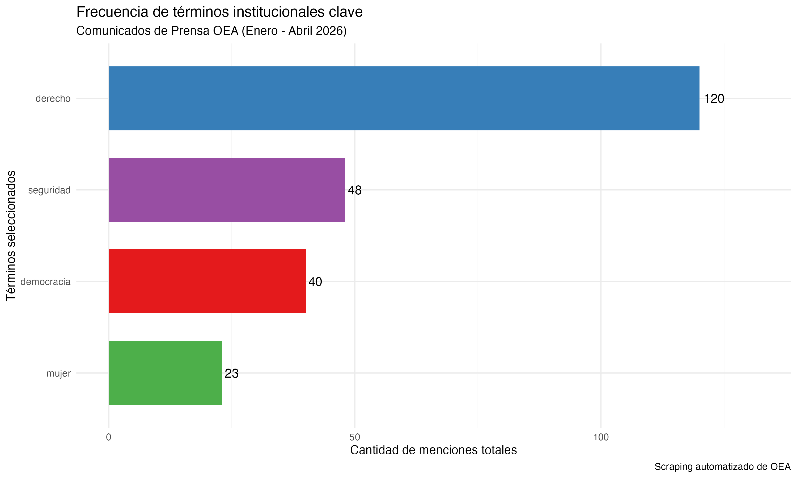

## Introducción

Este trabajo analiza la reproducción de palabras entre enero y abril de 2026 a partir de comunicados oficiales publicados por la Organización de los Estados Americanos. Además de recolectar los datos, se los transforma mediante técnicas de procesamiento de lenguaje natural para identificar qué conceptos dominan el discurso institucional del organismo.

A partir de esto, planteo la siguiente pregunta: ¿Qué temas y conceptos aparecen con mayor centralidad en el discurso público de la OEA durante el período analizado?

## Análisis

### Scraping

El script "scraping_oea.r" recorre los links mensuales de la OEA que se le especificaron, identificando elnaces válidos y descargando cada comunicado. De cada uno se extrae el título y el cuerpo del texto, guardando tanto el HTML crudo como una tabla consolidada en formato .*rds*.

### Procesamiento y lematización

El script "processing.r" trabaja sobre la base del script anterior, limpiando el texto, lematizando al español mediante udpipe y eliminando stopwords. El resultado es una base de lemas que permite analizar el contenido semántico real del contenido, evitando duplicaciones por gramática.

### Métricas

El script "metric_figures.r" calcula la frecuencia de los lemas y, a partir de esa información, selecciona las cinco palabras más utilizadas para el análisis del discurso institucional. Con esas palabras se construyó el gráfico final que compara su frecuencia.

## Ejecución del código

```{r}
library(here)
# Ejecutar cada etapa en orden
source(here("TP2/scripts/scraping_oea.r"))
source(here("TP2/scripts/processing.r"))
source(here("TP2/scripts/metric_figures.r"))
```

## Gráfico de Resultados



## Conclusión

La figura muestra la frecuencia de aparición de cinco conceptos seleccionados por su relevancia dentro del discurso de la OEA, las palabras seleccionadas fueron democracia, derecho, estado, seguridad y mujer. La importancia de estos términos muestra que el discurso institucional del organismo durante el período analizado se estructura alrededor de la defensa del orden democrático, el fortalecimiento del Estado de derecho, la preocupación por la seguridad regional y la inclusión de la perspectiva de género.
